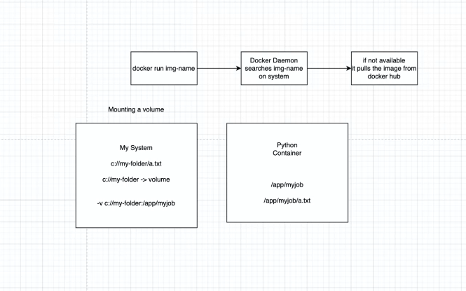

# python-docker

docker run
--this command used to run any image
--image is nothing but our project
so if you dont have image ready, docker hub gives you images which contains existing projects in images
#docker run hello-world
here hello-world is the docker image name avaliable in docker hub

docker images
--this command will list out all the images avaliable on host system
docker images -a
--will let you display which are hidden
so here what happens when we run a image is
--if the image is not avaliable in out local system it will pull the image from github and then it will run
--and when we run it again it will automatically have the image loaded on your git
git pull <image>
--this will pull the image from docker hub

where is the container?

--to check the containers that are running
docker ps

since this is shows nothing because
when we run the image in docker when all the work is completed the container is closed or shut down

so to see all the history of containers and also active containers.

docker ps -a
@ManvithaAinavolu ➜ /workspaces/python-docker (main) $ docker ps -a
CONTAINER ID   IMAGE         COMMAND    CREATED         STATUS                     PORTS     NAMES
6cf97213c69e   hello-world   "/hello"   4 minutes ago   Exited (0) 4 minutes ago             heuristic_heisenberg
9dfdff830d13   hello-world   "/hello"   5 minutes ago   Exited (0) 5 minutes ago             eloquent_engelbart
every container finishes its job and will end

to run a python code in docker we need to search for a python image in docker hub
docker run python

how to give a job to python image?
because theres is no job for container it will stop immediately when completed the task.
so to give a job:
--docker run <image> -c "print('hello')"
here '-c' is used to write some command while running another commands in docker.
docker run python python -c 'print("hello")'
            img     library
--here python is the python image from docker hub
and another python is for running python code in the terminal in the single line in the python image

how to run a python file in a container?

volumes:  since we dont have main.py in container we use volumes.

docker run python -c "python main.py"

--this will give error because the main.py is not in python image

docker run -v .:/app python python  /app/main.py

here -v is used to create a volume so that particular folder will be innjected to the container.
        -'. : ' means current directory,
        

here,this process is called mounting a volume.
here mounting is not just copying but reflecting the live version,
that means if you modfy or do any changes in the file it will reflects in container also.
similarly, if we want to do that same with node js

docker run --rm -v .:/app node node /app/app.js

To know the version of the image in docker
docker run --rm python python --version

--we are using --rm is to delete the container once the job is completed

to use the version of you wish then

docker run --rm -v .:/app python :<version> python --version.
use your required verision in the place of <version>

